# 🌍 AIVA - Artificial Intelligence for a Vitalized Earth


## "Because Earth Deserves a Digital Voice" 🎤

*Finally, someone who listens to Mother Nature's complaints about us humans...*


### 🤖 **Meet Your New Environmental Best Friend**

AIVA isn't just another boring environmental app - it's Earth's first AI therapist! Think of it as:
- **Earth's Personal Diary** 📝 - Where the planet shares its daily mood swings
- **Climate Change Detector** 🕵️ - Catches environmental drama before it goes viral
- **Nature's Voice Assistant** 🗣️ - Siri, but for saving the planet
- **Your Guilt-Trip Generator** 😅 - Makes you feel bad about that plastic bottle (in a good way)

### 🎭 **What Makes AIVA Hilariously Awesome**


- **Emotional Earth**: Watch our planet throw tantrums when forests burn and celebrate when you plant trees
- **Sarcastic AI Responses**: "Oh great, another oil spill. Just what I needed today." - Earth, probably
- **3D Earth That Actually Cares**: A globe that judges your carbon footprint
- **Voice Synthesis**: Earth literally talks to you (and it has OPINIONS)
- **Real-Time Drama**: Live environmental updates with more plot twists than a soap opera

## 🚀 **The Tech Magic Behind Earth's Attitude**


### **Frontend: The Pretty Face**
- **Next.js 14** - Because regular websites are so 2020
- **TypeScript** - For when JavaScript needs adult supervision
- **React Three Fiber** - Making Earth spin faster than climate anxiety
- **Tailwind CSS** - Making it look good while the world burns

### **Backend: The Brain Surgery**
- **Flask API** - Python's way of saying "I got this"
- **12+ Endpoints** - More routes than a GPS on vacation
- **Gemini 2.5 Flash** - Google's AI having existential talks with Earth
- **ElevenLabs TTS** - Because reading is for peasants, Earth SPEAKS now
- **Real Environmental APIs** - No fake news here, just real climate drama

### **The AI Squad**
- **Sentiment Analysis** - Detecting Earth's mood swings since 2025
- **CNN Satellite Vision** - AI that can spot a deforested area from space (and judge you for it)
- **Emotional Mapping** - Converting "polar ice melting" to "Earth is crying"
- **Chunked TTS Pipeline** - Because Earth has A LOT to say and won't be cut off mid-rant

## 🏃‍♂️ **Quick Setup (Faster Than Climate Change)**


### 1. **Backend Setup** (Earth's Brain Surgery)
```bash
cd Backend
pip install -r requirements.txt

# Give the AI its brain juice
$env:GEMINI_API_KEY="your-gemini-api-key-here"
$env:ELEVENLABS_API_KEY="your-elevenlabs-key-here"

# Wake up the Earth
python app.py
```
*Congrats! Earth is now digitally conscious and probably judging your life choices.*

### 2. **Frontend Setup** (The Pretty Interface)
```bash
cd nextjs-typescript-app
npm install
npm run dev
```
*Now you can see Earth spinning in all its judgmental glory at http://localhost:3000*

### 3. **Test Earth's Personality**
Try these conversations with our moody planet:

**Happy Earth**: "The forests are growing!" 🌱
**Sad Earth**: "The ice caps are melting..." 😢  
**Angry Earth**: "Another oil spill?!" 😡
**Hopeful Earth**: "Solar panels are increasing!" ☀️

*Warning: Earth may become sarcastic if you ask stupid questions.*

## 🧠 **How Earth Got Smart (The AI Drama)**

### **The Secret Sauce Recipe**

```mermaid
flowchart TD
    A[🌍 Real Environmental Data] --> B[🧠 AI Brain Processing]
    B --> C{🎭 Emotion Engine}
    C -->|Happy| D[😊 Joyful Response]
    C -->|Sad| E[😢 Concerned Response]
    C -->|Angry| F[😡 Urgent Warning]
    D --> G[🎤 Voice Synthesis]
    E --> G
    F --> G
    G --> H[📱 Chunked Audio Pipeline]
    H --> I[🔊 Earth Speaks to Human]
    I --> J[👤 Human Feels Guilty]
    J --> K[♻️ Takes Action]
    K --> A
    
    style A fill:#e1f5fe
    style C fill:#fff3e0
    style G fill:#f3e5f5
    style I fill:#e8f5e8
    style J fill:#ffebee
```

```
Step 1: Take real environmental data (no fake ingredients)
Step 2: Add AI with more neurons than humans have brain cells
Step 3: Teach it to have feelings (mistake? maybe...)
Step 4: Give it a voice (definitely a mistake)
Step 5: Let it judge humanity (critical error)
Result: One very opinionated digital planet
```

### **The API Endpoints (Earth's Communication Channels)**
- **POST /conversation** - Chat with Earth (prepare for sass)
- **GET /environment** - Get Earth's current mood report
- **POST /analyze** - Deep analysis (Earth's therapy session)
- **GET /health** - Check if Earth is still talking to us
- **POST /weather** - Because Earth controls the weather and likes to brag

### **The Voice Pipeline (Earth's Vocal Cords)**
1. **Earth thinks** (Gemini AI processes environmental data)
2. **Earth feels** (Sentiment analysis adds emotions)
3. **Earth speaks** (ElevenLabs makes it sound dramatic)
4. **Earth chunks** (Our genius solution to avoid audio cutoffs)
5. **Humans listen** (And hopefully feel guilty enough to recycle)

### **The "No Fake News" Guarantee**
- ✅ **Real satellite images** - Earth's actual selfies from space
- ✅ **Live environmental data** - Fresh drama delivered hourly
- ✅ **Actual AI responses** - Not some intern pretending to be smart
- ✅ **Genuine emotions** - Earth's feelings are validated and heard
- ❌ **Zero fake data** - Unlike your ex's promises

### **The Technical Wizardry**
- **Multi-Modal Intelligence**: Sees like a hawk, thinks like Einstein, speaks like a drama queen
- **Chunked TTS Pipeline**: Our masterpiece - no more audio cutoffs mid-breakdown
- **Sentiment Mapping**: Converts "CO2 levels rising" to "Earth is having a panic attack"
- **Real-Time Processing**: Faster than your ability to make excuses for not recycling

### **Earth's Personality Traits**
- **Sassy**: Will call you out on your carbon footprint
- **Dramatic**: Everything is either "wonderful" or "apocalyptic"
- **Hopeful**: Still believes humans can change (naive but cute)
- **Informative**: Knows more about climate than your conspiracy theorist uncle

## 🔥 **Features That'll Blow Your (Sustainable) Mind**


1. **Earth Talks Back** - Finally, a planet with customer service
2. **3D Earth Visualization** - Prettier than Instagram filters
3. **Emotional Responses** - Earth has more feelings than a teenager
4. **Voice Synthesis** - Hear Earth's disappointment in surround sound
5. **Real-Time Data** - Because fake news is so last century
6. **Conversation Memory** - Earth remembers your promises (and broken ones)
7. **12+ API Endpoints** - More connections than your LinkedIn network

## 🌟 **Success Stats (Humble Bragging Section)**

- **0% Mock Data** - We keep it 100% real, unlike your gym attendance
- **12+ API Endpoints** - More routes than a pizza delivery driver
- **Advanced AI** - Smarter than the average bear (and human)
- **Real Environmental APIs** - Connected to more sources than a journalist
- **Emotional Intelligence** - Higher EQ than most dating app matches
- **Voice Synthesis** - Better pronunciation than Google Translate

---

## 🎭 **The AIVA Experience**


**User**: "How are you feeling today, Earth?"

**AIVA**: "Well, someone just cut down another rainforest, the ice caps are having an identity crisis, but hey - solar panel installations are up 12%! So I'm cautiously optimistic, like a parent watching their kid try to ride a bike while holding a chainsaw."

**User**: "What should I do to help?"

**AIVA**: "Start by not asking me to solve problems you created, but since you asked nicely... *proceeds to give a 10-minute TED talk about sustainable living*"

---

🎯 **AIVA: Where Technology Meets Earth's Infinite Sass and Wisdom!**


*Built with love, coffee, and an unhealthy amount of environmental anxiety* ☕🌍💚